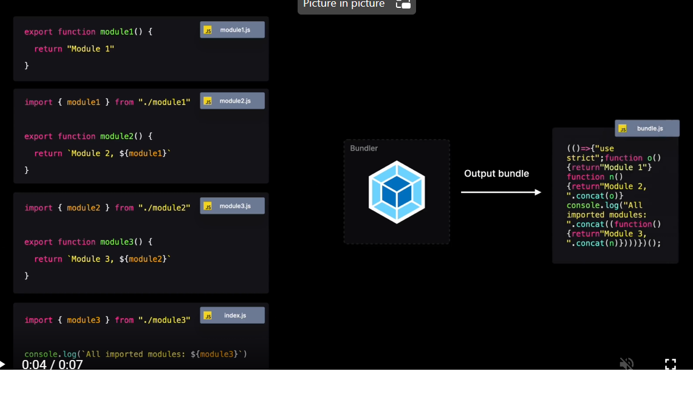

<h2>Bundling</h2>
The file that the browser has to download and fetch only contains relevant code, to ensure the browser can quickly fetch this bundle without too much bandwidth.

<b>Bundlers</b> bundles our app together in one or multiple files
 - can also make code executable in other environments (ie browsers)
 - a bundler receives and `entry` file , from which it starts to bundle the code together
  - if we're importing modules from other files, the bundler traverses these modules in order to include them all in the bundle
  - ex: 
  - how the bundler creates the output file is entirely configurable
  - common bundlers = webpack, parcel, rollup

<b>Compilers</b> converts javascript/typescript code into another version of js, which could be backwards compat in older browser versions.
 - eg we <i>can</i> use a Private class in js, but not all browsers suppot it yet
 - common compiler = babel

<b>Minifiers</b> can reduce the size of a js file based on a certain config (removes comments, makes vars and function names smaller, removing whitespace, etc)
 - this results in smaller bundle size and faster execution
 - common minifiers = terser, uglify

Combination = ESBuild (a Go-based compiler, bundler, + minifier)

<h2>Practices</h2>

<b>Bundle splitting</b> is the process of creating multiple, smaller bundles rather than one large bundle
 - smaller bundles = less loading, processing, and esecution time (good for users on slow networks or low end devices)

<b>Tree Shaking</b> reduces bundle size by eliminating dead code
 - removes unused code from a js bundle (ie functions not referenced in code)

<b>Static import</b> - a statically imported module is a module that's imported with the default `import` keyword.
```
import module1 from "./module1";
```

 - When a module is statically imported, a bundler traverses all the modules, and bundles them into one file.
 - With react, you can import components from other files. The modules get executed as soon as the engine reaches the line on which we import them
  - Loading instant dependencies: Statically imported components are instantly available to the user
  - Optimizations: Statically imported modules can be statically analyzed and tree-shaken.
  - Large bundle size: When importing all modules, you might include code that won't be necessary


<b>Dynamic import</b> - import parts of your code on demand.
 - statically imported modules are all included in the final bundle of your app, even components that don't need to be rendered right away
 - could lead to slow initial load (client needs to download/parse entire bundle)

Implementation:
 - In React, we can dynamically load a component by using `React.Suspense` with `React.lazy`.
 - The Suspense component receives a fallback, that gets rendered while the client is fetching the bundle (like "loading..." text).

Pros: faster load, smaller initial bundle size
Cons: may shift layout if your fallback component is very different size than rendered component, may be longer loading times for user. Try to only lazy load components not used on initial render.