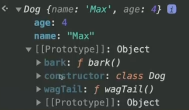

If we want to share properties among many objects of the same type, we can use the Prototype pattern.


Before with factory functions, we would create a new object in memory for every book we wanted to create. That means each book has a the same methods unnecessarily added to it in memory. 

If we use the Prototype pattern (classes and `new` keyword), then you can share methods among many objects.
 - Everything on a class that is part of the body, is considered as a part of the <b>prototype</b>. That means child objects have access to those methods via the <b>prototype chain</b>

Factory Pattern:
```
const createDog = (name, age) => ({
  name,
  age,
  bark() {
    console.log(`${name} is barking!`);
  },
  wagTail() {
    console.log(`${name} is wagging their tail!`);
  },
});

const dog1 = createDog("Max", 4);
const dog2 = createDog("Sam", 2);
const dog3 = createDog("Joy", 6);
const dog4 = createDog("Spot", 8);
```

Prototype Pattern:
```
class Dog {
  constructor(name, age) {
    this.name = name;
    this.age = age;
  }

  bark() {
    console.log(`${this.name} is barking!`);
  }
  wagTail() {
    console.log(`${this.name} is wagging their tail!`);
  }
}

const dog1 = new Dog("Max", 4);
const dog2 = new Dog("Sam", 2);
const dog3 = new Dog("Joy", 6);
const dog4 = new Dog("Spot", 8);
```

See the example above and how it inherits the Object prototype in browser:

